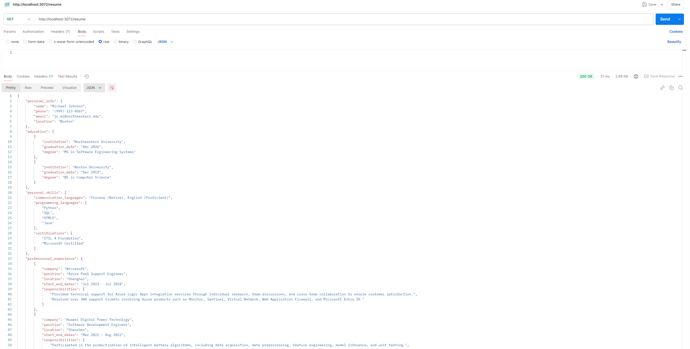

# Instructions to Set Up and Use the Resume API

1. Install Node.js  
   Ensure you have Node.js installed on your device. You can download it from [Node.js Official Website](https://nodejs.org/).

2. Set Up the API:  
   Navigate to the `api` directory and install the required dependencies, then start the server:
   ```
   cd api
   npm install  
   npx nodemon server.js
   ```

3. Retrieve Resume JSON:  
   After starting the server, you can use the **GET** method to retrieve the resume JSON data via the following endpoint:  
   ```
   GET http://localhost:3072/resume
   ```
   
4. Additional Information:  
   Once you click the **Download** icon of `edit.html`, the resume JSON will be available for retrieval. 
   